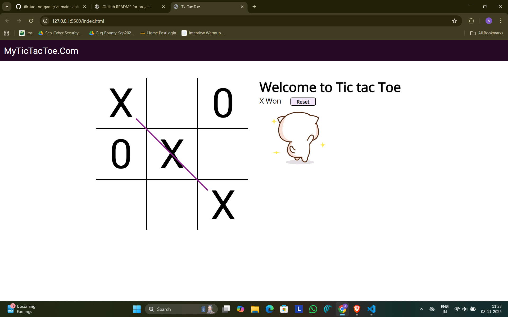

# Tic Tac Toe Game (HTML, CSS, JavaScript)

This is a browser-based **Tic Tac Toe** game built using **HTML**, **CSS**, and **JavaScript**.  
The game allows two players to play against each other on the same device.  
It includes win detection, draw detection, and a reset functionality.  
The design is clean, responsive, and interactive.

---

##  Features

- Two-player gameplay (X vs O)
- Automatic win detection and line drawing upon victory
- Detects and displays when the match ends in a draw
- Reset/Restart button to play again
- Clean and user-friendly UI
- Fully responsive layout

---

##  Technologies Used

| Technology | Purpose |
|-----------|---------|
| **HTML5** | Structure of the game board and layout |
| **CSS3**  | Styling, animation, and responsiveness |
| **JavaScript** | Game logic, event handling, and win/draw detection |

---

##  Screenshot

